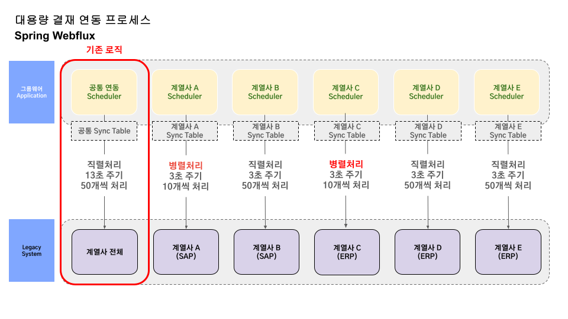

# Spring WebFlux 기반 비동기 처리 시스템 구축

## 1. Spring WebFlux의 정의

Spring WebFlux는 Spring Framework 5.0에서 추가된 리액티브 프로그래밍 모델로, 비동기 논블로킹(Non-blocking) 방식으로 웹 애플리케이션을 개발하기 위해 설계되었습니다. Reactive Streams API를 기반으로 하며, 대표적으로 `Flux`와 `Mono`라는 두 가지 Publisher를 사용합니다.

## 2. Spring WebFlux를 사용하게 된 계기

세아그룹의 여러 계열사 시스템 요구사항을 반영하기 위해 Spring WebFlux를 사용하게 되었습니다. 기존의 레거시 ERP 시스템은 결재 상태 값에 대한 요청을 동기적으로 처리했기 때문에, 성능 저하 문제가 발생하였습니다. 그러나 차세대 프로젝트로 도입된 SAP 시스템은 결재 상태 값 요청을 비동기적으로 처리할 수 있는 환경을 제공하여, 보다 효율적인 데이터 처리와 성능 향상을 기대할 수 있게 되었습니다.

### 사용 배경
- **레거시 ERP 시스템:** 결재 상태 값 요청을 동기 방식으로 처리 → 처리 속도 저하 문제 발생
- **차세대 SAP 시스템:** 결재 상태 값 요청을 비동기 방식으로 처리 가능 → WebFlux의 도입으로 효율성 개선 기대
### 연동 프로세스 아키텍처


## 3. build.gradle 설정

Spring WebFlux를 사용하기 위해 `build.gradle` 파일에 다음과 같은 의존성을 추가합니다.

```groovy
implementation 'org.springframework.boot:spring-boot-starter-webflux'
```

## 4. 연동 처리 로직

아래는 Spring WebFlux를 사용하여 비동기적으로 데이터 처리를 수행하는 로직의 예시입니다. 각 단계에 대해 주석을 추가하여 설명합니다.

```java
public void executeSyncFlux(String tableName, int count) throws Exception {
    Map<String, Object> commandMap = new HashMap<>();
    commandMap.put("table_name", tableName);
    commandMap.put("count", count);

    // 대상 데이터 목록 조회
    List<Map<String, Object>> list = gwSyncV2Mapper.selectApprGWSyncListForReady(commandMap);
    if (list != null && list.size() > 0) {
        Flux.fromIterable(list) // 리스트를 Flux 스트림으로 변환
            .map(item -> {
                item.put("table_name", tableName); // 처리할 테이블 이름 설정
                return item;
            })
            .flatMap(this::processApprGWSync) // 비동기적으로 데이터 처리
            .onErrorContinue((e, item) -> {
                logger.error("##-- SYNC EXCEPTION ERROR", e); // 에러 발생 시 로그 출력
            })
            .subscribe(); // 스트림 실행 시작
    }
}

// WebFlux를 사용하여 비동기 처리 결과를 Mono로 반환
public Mono<Void> processApprGWSync(Map<String, Object> item) {
    return Mono.fromCallable(() -> {
        // WebFlux 구현 로직
        // (예: 외부 API 호출, 데이터베이스 저장 등)
        return true;
    })
    .onErrorResume(e -> {
        logger.error("##-- WebFlux 에러 처리", e); // 에러 발생 시 처리
        return Mono.empty();
    })
    .doOnSuccess(isSuccess -> {
        if (Boolean.TRUE.equals(isSuccess)) {
            logger.info("##-- WebFlux 처리 성공"); // 성공 시 로그 출력
        }
    })
    .doFinally(signal -> {
        logger.info("##-- WebFlux 처리 완료: " + signal.name()); // 처리 완료 후 최종 로그 출력
    });
}
```

### 설명
1. `Flux.fromIterable()` : 주어진 리스트를 Flux 스트림으로 변환하여 비동기 처리합니다.
2. `map()` : 각 데이터 항목에 추가 정보를 설정합니다.
3. `flatMap()` : 비동기 방식으로 데이터를 처리하며, 여기서 `processApprGWSync()` 메서드를 호출합니다.
4. `onErrorContinue()` : 처리 중 에러가 발생하더라도 스트림을 중단하지 않고 계속 처리합니다.
5. `Mono.fromCallable()` : 비동기 처리 로직을 래핑하여 반환합니다.
6. `doOnSuccess()` / `doFinally()` : 처리 완료 후 로그를 출력하여 상태를 확인할 수 있습니다.
